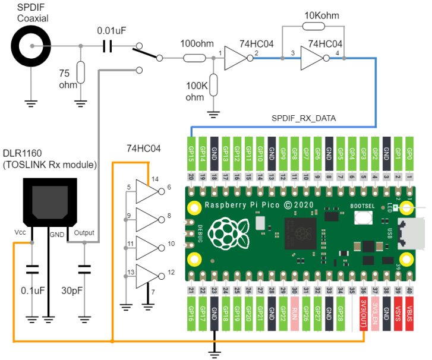

# Raspberry Pi Pico S/PDIF receiver library

## Overview
* S/PDIF receiver by rp2040 PIO function
* format: 2ch, 16bit or 24bit
* sampling frequency: 44.1 KHz, 48.0 KHz, 88.2 KHz, 96.0 KHz, 176.4 KHz, 192.0 KHz
* signal detecting function for all supported sampling frequencies

## Supported Board and Peripheral Devices
* Raspberry Pi Pico (rp2040)
* S/PDIF Coaxial or TOSLINK Rx module (DLR1160 or equivalent)

## Pin Assignment & Connection
### S/PDIF Rx
| Pico Pin # | GPIO | Function | Connection |
----|----|----|----
| 20 | GP15 | DATA | from S/PDIF data |



Notes:

* 74HC04 should be genuine device, otherwise (counterfeit device) it could not work at higher sampling frequencies.
* if TOSLINK only, direct connection from module output to GP15 will work as well.

## How to build
* See ["Getting started with Raspberry Pi Pico"](https://datasheets.raspberrypi.org/pico/getting-started-with-pico.pdf)
* Put "pico-sdk", "pico-examples" and "pico-extras" on the same level with this project folder.
* Set environmental variables for PICO_SDK_PATH, PICO_EXTRAS_PATH and PICO_EXAMPLES_PATH
* Confirmed with Pico SDK 2.0.0
```
> git clone -b 2.0.0 https://github.com/raspberrypi/pico-sdk.git
> cd pico-sdk
> git submodule update -i
> cd ..
> git clone -b sdk-2.0.0 https://github.com/raspberrypi/pico-examples.git
>
> git clone -b sdk-2.0.0 https://github.com/raspberrypi/pico-extras.git
> 
> git clone -b main https://github.com/elehobica/pico_spdif_rx.git
```
### Windows
* Build is confirmed with Developer Command Prompt for VS 2022 and Visual Studio Code on Windows environment
* Confirmed with cmake-3.27.2-windows-x86_64 and gcc-arm-none-eabi-10.3-2021.10-win32
* Lanuch "Developer Command Prompt for VS 2022"
```
> cd pico_spdif_rx\samples\xxxxx  # sample project directory
> mkdir build && cd build
> cmake -G "NMake Makefiles" ..
> nmake
```
* Put "xxxxx.uf2" on RPI-RP2 drive
### Linux
* Build is confirmed with [pico-sdk-dev-docker:sdk-2.0.0-1.0.0]( https://hub.docker.com/r/elehobica/pico-sdk-dev-docker)
* Confirmed with cmake-3.22.1 and arm-none-eabi-gcc (15:10.3-2021.07-4) 10.3.1
```
$ cd pico_spdif_rx/samples/xxxxx  # sample project directory
$ mkdir build && cd build
$ cmake ..
$ make -j4
```
* Download "xxxxx.uf2" on RPI-RP2 drive

## Decode output format
* 32bit output for each S/PDIF sub frame including header, audio data, AUX, VUCP
* see comments in [spdif_rx.pio](spdif_rx.pio) for further detail

## Sample projects
### detect_samp_freq
* display sampling frequency, C bits of S/PDIF frame and number of parity errors while decoding

### spdif_to_i2s_32b
* convert S/PDIF input to I2S 32bit output

## Application Examples
* [pico_spdif_recorder](https://github.com/elehobica/pico_spdif_recorder)
* [pico_spdif_dac_hpamp](https://github.com/elehobica/pico_spdif_dac_hpamp)
