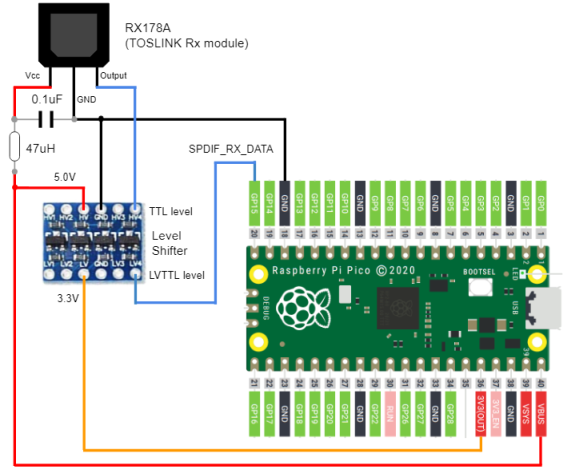

# Raspberry Pi Pico spdif_rx

## Overview
* SPDIF decoder by rp2040 PIO
* supports to decode in 44.1 KHz, 48.0 KHz sampling frequency / 2ch / 16bit

## Supported Board and Peripheral Devices
* Raspberry Pi Pico (rp2040)
* SPDIF Coaxial or TOSLINK RX178A equivalent receiver
* PCM5102 (spdif_to_i2s_32 project only)

## Pin Assignment
### SPDIF Rx
| Pico Pin # | GPIO | Function | Connection |
----|----|----|----
| 20 | GP15 | DATA | from SPDIF/TOSLINK Data output|



### PCM5102 (spdif_to_i2s_32 project only)
| Pico Pin # | GPIO | Function | Connection |
----|----|----|----
| 21 | GP16 | BCK | to PCM5102 BCK (13) |
| 22 | GP17 | LRCK | to PCM5102 LRCK (15) |
| 23 | GND | GND | GND |
| 24 | GP18 | SDO | to PCM5102 DIN (14) |
| 40 | VBUS | VCC | to VIN of PCM5102 board |


## How to build
* See ["Getting started with Raspberry Pi Pico"](https://datasheets.raspberrypi.org/pico/getting-started-with-pico.pdf)
* Build is confirmed only in Developer Command Prompt for VS 2019 and Visual Studio Code on Windows enviroment
* Put "pico-sdk", "pico-examples" (, "pico-extras" and "pico-playground") on the same level with this project folder.
* Confirmed under Pico SDK 1.4.0
```
> git clone -b master https://github.com/raspberrypi/pico-sdk.git
> cd pico-sdk
> git submodule update -i
> cd ..
> git clone -b master https://github.com/raspberrypi/pico-examples.git
>
> git clone https://github.com/raspberrypi/pico-extras.git
> cd pico-extras
> git submodule update -i
> cd ..
> 
> git clone -b main https://github.com/elehobica/pico_spdif_rx.git
```
* Lanuch "Developer Command Prompt for VS 2019"
```
> cd pico_spdif_rx
> mkdir build
> cd build
> cmake -G "NMake Makefiles" ..
> nmake
```
* Put "pico_spdif_rx.uf2" on RPI-RP2 drive

## Sample projects
select target project file in `CmakeLists.txt`
### detect_samp_freq
* scan several frequencies until it decodes
* display sample frequency, C bits of SPDIF frame and number of parity errors

### spdif_to_i2s_32b
* convert SPDIF input to I2S 32bit
* push '=' or '+' to volume up, push '-' to volume down in serial console