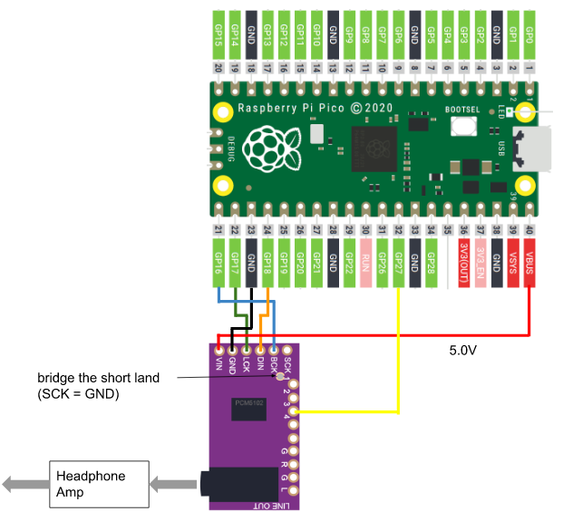

# Raspberry Pi Pico S/PDIF receiver library

## spdif_to_i2s_32b Project
* convert S/PDIF input to I2S 32bit

## Supported Board and Peripheral Devices
* Raspberry Pi Pico (rp2040)
* S/PDIF Coaxial or TOSLINK (RX178A or equivalent) receiver
* PCM5102 (spdif_to_i2s_32 project only)

## Pin Assignment
### PCM5102 (spdif_to_i2s_32 project only)
| Pico Pin # | GPIO | Function | Connection |
----|----|----|----
| 21 | GP16 | BCK | to PCM5102 BCK (13) |
| 22 | GP17 | LRCK | to PCM5102 LRCK (15) |
| 23 | GND | GND | GND |
| 24 | GP18 | SDO | to PCM5102 DIN (14) |
| 40 | VBUS | VCC | to VIN of PCM5102 board |

## Operation
* push '=' or '+' to volume up, push '-' to volume down in serial console